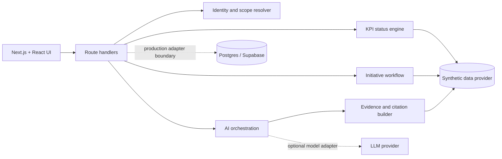

# KPI OS — executive intelligence

[](https://github.com/juanlopolicaarpio/executive-kpi-os/actions/workflows/ci.yml)

An AI-assisted operating system for turning company metrics into accountable action. It combines an executive KPI scorecard, anomaly triage, recovery initiatives, role-aware workflows, and an evidence-grounded AI coach in one full-stack application.

> **Public release:** this system is based on software I built and shipped for a real operating business. Confidential company data has been replaced with a fictional organization, people, identifiers, and synthetic metrics. It is not connected to a client or production environment.

## What this demonstrates

- Full-stack product engineering with Next.js 16, React 19, TypeScript, and server route handlers.
- A reusable KPI engine with direction-aware targets, status bands, trends, drill-downs, and role-scoped views.
- Operational workflows that turn a missed KPI into an owned initiative, review trail, result, and reusable learning.
- AI product design that packages evidence, limitations, citations, and user feedback instead of presenting unsupported prose.
- Data-platform thinking: ingestion boundaries, normalized metrics, dimensional drill-downs, access control, and auditability.
- A reproducible demo mode that runs without credentials, external APIs, or confidential company data.

## Product surfaces

| Surface | What it shows |
|---|---|
| Today | Role-aware daily brief, KPI exceptions, decisions, and follow-ups |
| KPI registry | Targets, owners, cadence, health, trend, and detailed history |
| Initiatives | Draft → review → execution → results lifecycle with event history |
| People | Ownership and performance views scoped by persona |
| AI Coach | Deterministic demo responses grounded in the bundled dataset |
| Admin | Users, roles, policies, and upload-history concepts |

## Architecture



The public runtime selects the synthetic provider. Production adapters remain behind server-only boundaries and are not configured or called by the demo. See [the architecture deep dive](docs/ARCHITECTURE.md) and [the public-release safety model](docs/PUBLIC_RELEASE.md).

## Fictional demo team

The persona switcher lets reviewers see the same system through different scopes.

| Persona | Role | View |
|---|---|---|
| Avery Morgan | CEO | Company-wide scorecard and initiatives |
| Jordan Lee | CFO | Profitability, forecast, and economics |
| Casey Brooks | Head of Growth | Acquisition and conversion funnel |
| Morgan Patel | Paid Acquisition Lead | Channel efficiency and CPA |
| Riley Chen | CRM & Lifecycle Lead | Retention, cross-sell, and LTV |

No login is required for the local demo. Authentication-related screens are retained to demonstrate the production boundary, but the bundled experience uses fictional personas only.

## Run locally

Requirements: Node.js 20+ and npm.

```bash
npm ci
npm run dev
```

Open `http://localhost:3003`.

Optional production adapters are documented in `.env.example`; they are not needed for the public demo.

## Quality gates

```bash
npm run lint
npm run typecheck
npm test
npm run build
# or all four
npm run check
```

CI runs the same gates on every pull request and push to `main`.

## Repository map

```text
app/                 pages and server route handlers
components/          product and design-system components
lib/kpi/             target, status, trend, and monitoring logic
lib/ai/              prompts, ranking, context, and evidence handling
lib/northstar/       explicitly synthetic demonstration dataset
lib/initiatives/     initiative mapping and workflow helpers
supabase/             reference schema and edge-function examples
types/                domain contracts
docs/                 architecture and public-release safety decisions
```

## Scope and limitations

- The public dataset is deterministic and intentionally small enough to inspect.
- AI responses in demo mode are local and deterministic, so reviewers do not spend API credits.
- Production credentials, client exports, private identifiers, and original Git history are deliberately excluded.
- Northstar Commerce is fictional and is used only to demonstrate the system without exposing a real organization.

## Author

Built by [Juanlo Policarpio](https://github.com/juanlopolicaarpio).

Copyright © 2026 Juanlo Policarpio. All rights reserved. See [LICENSE](LICENSE).
