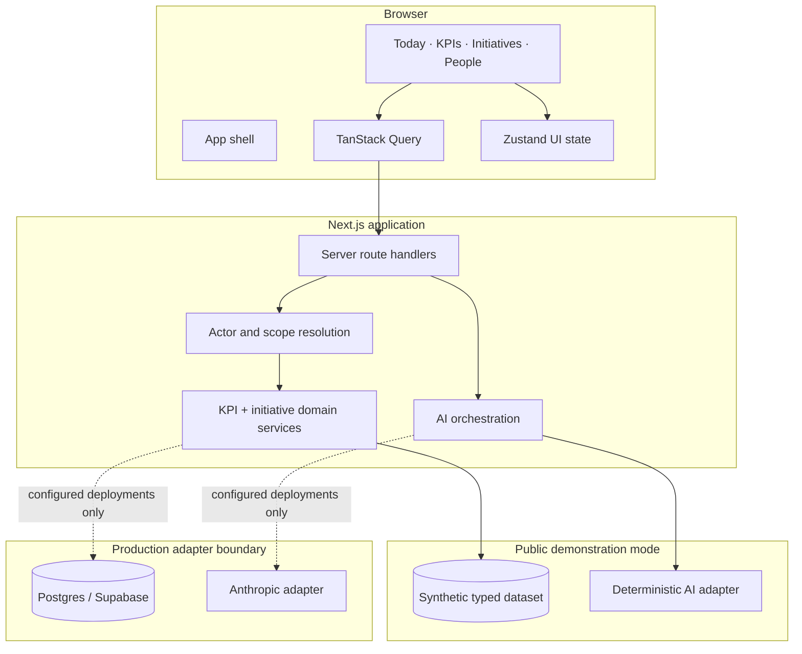
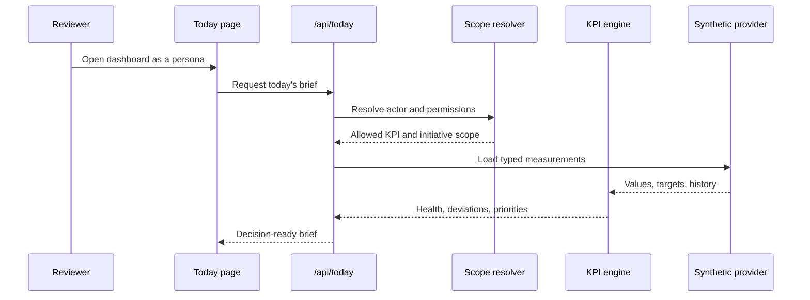
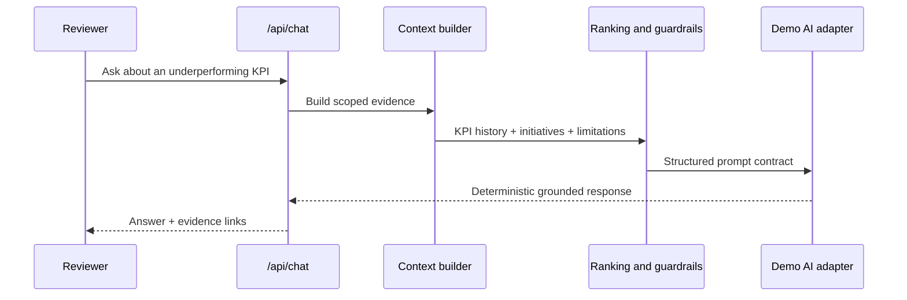
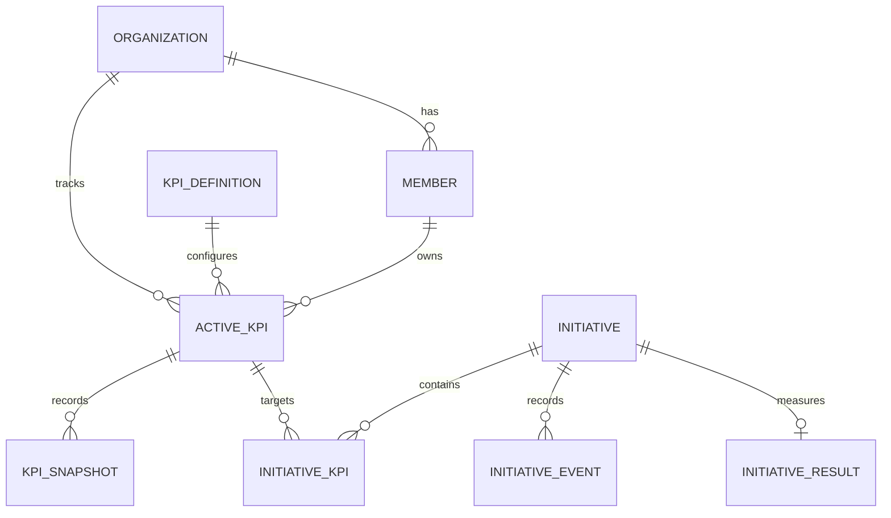

# Architecture

## Design goal

KPI OS is designed around one operating loop:

```text
measure → detect → assign → act → review → remember
```

Dashboards are only the presentation layer. The core domain connects a KPI to an owner, target, cadence, evidence, intervention, and final outcome.

## Runtime topology



## Major decisions

### Server-owned business rules

The browser renders results but does not decide KPI health, initiative permissions, or AI evidence. Route handlers resolve the acting persona and apply the same domain rules for every client.

### Direction-aware KPI status

Targets can be `above` or `below`. Revenue is healthy above target; acquisition cost is healthy below target. The status engine normalizes both cases into consistent health and deviation semantics.

### Evidence before prose

The AI layer receives a structured evidence bundle containing the relevant KPI values, time window, owner, initiatives, and data limitations. Responses expose supporting sources and avoid inventing missing context.

### Workflow, not a task list

An initiative captures baseline, target, owner, budget, review state, updates, and measured results. Completing an initiative produces a reusable learning rather than simply closing a ticket.

### Adapter boundary for public release

The public build defaults to local fixtures and deterministic responses. Database and model integrations are optional adapters. This keeps the demo reproducible while preserving the architecture used for a real deployment.

## Request flow: executive brief



## Request flow: AI coach



## Data model, simplified



The public application uses typed in-memory equivalents of these concepts. Reference SQL is included to demonstrate relational modeling, RLS-aware deployment patterns, and migration discipline.
